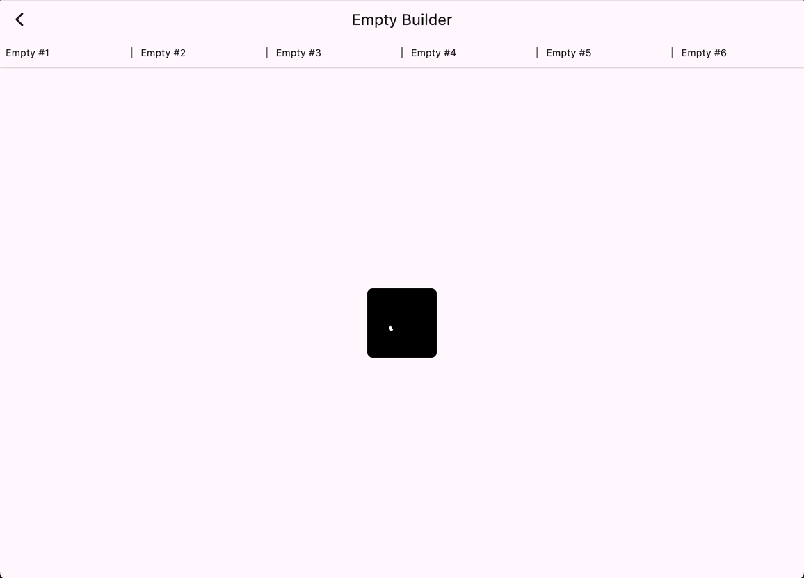
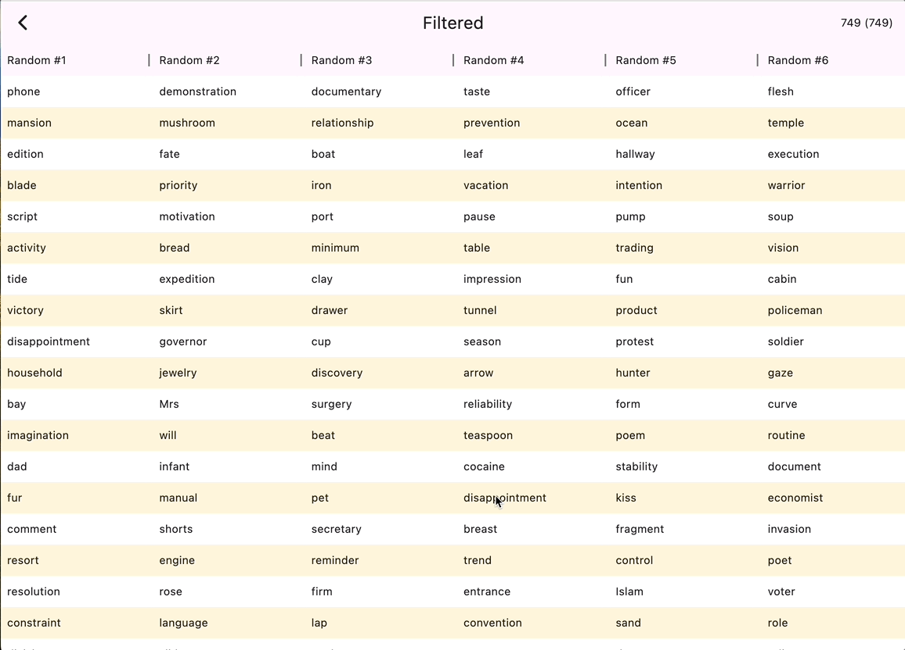
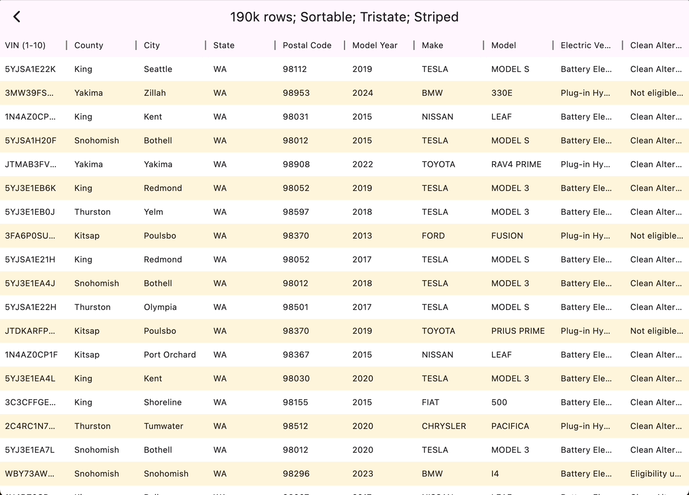

# flex_table

<!-- START doctoc generated TOC please keep comment here to allow auto update -->
<!-- DON'T EDIT THIS SECTION, INSTEAD RE-RUN doctoc TO UPDATE -->
**Table of Contents**

- [flex_table](#flex_table)
  - [Introduction](#introduction)
  - [Components](#components)
    - [FlexTable](#flextable)
      - [Setting Column Sizes](#setting-column-sizes)
    - [EmptyDataBuilder](#emptydatabuilder)
    - [FlexCellBuilder](#flexcellbuilder)
      - [FlexDataCellBuilder](#flexdatacellbuilder)
        - [FlexStripeCellBuilder](#flexstripecellbuilder)
      - [FlexHeaderCellBuilder](#flexheadercellbuilder)
        - [FlexFilterHeaderCellBuilder](#flexfilterheadercellbuilder)
        - [FlexSortHeaderCellBuilder](#flexsortheadercellbuilder)
    - [FlexTableColumnSize](#flextablecolumnsize)

<!-- END doctoc generated TOC please keep comment here to allow auto update -->

## Introduction

The `FlexTable` is designed to be a table with fully resizable columns, a fixed header, with built in support for filtering and sorting.  It is also designed to support very large numbers of rows and the example has two data sets that have 56k and 190k rows respectively to demonstrate it's capabilities with very large data sets without requiring pagination.

It uses the wonderful [multi_spit_view](https://pub.dev/packages/multi_split_view) package to allow for the column resizing which is fully flex based and does not require column or row measurement.

For the built in filtering, it uses the [popover](https://pub.dev/packages/popover) package.  That package allows popovers with arbitrary widgets included and is capable of being significantly more performant than the built in `PopupMenuButton` which is documented pretty well in this [github issue](https://github.com/flutter/flutter/issues/138626)

---

## Components

### FlexTable

The `FlexTable` is the key class for all the functionality in this package.  A quick example for creating a `FlexTable` is:

```dart
class MyWidget extends StatefulWidget {
  MyWidget({
    required this.headers,
    super.key,
  })

  final List<String> headers;

  @override
  State createState() => _MyWidgetState();
}

class _MyWidgetState extends State<MyWidget> {
  final FlexTableController _controller = FlexTableController();
  late final StreamSubscription _columnSubscription;

  @override
  void initState() {
    super.initState();

    _columnSubscription = _controller.columnStream.listen((_) {
      final sizes = _controller.columnSizes.map((s))
      final flexes = <double>[];
      for (var size in sizes) {
        flexes.add(size.flex);
      }

      print('Updated column flex values: ${flexes})');
    });
  }

  @override
  void dispose() {
    _controller.dispose();
    super.dispose();
  }

  @override
  Widget build(BuildContext context) {
    return Scaffold(
      appBar: AppBar(title: Text('My Widget')),
      body: FlexTable(
        controller: _controller,
        dataBuilder: const FlexStripeCellBuilder(),
        headers: widget.headers,
      ),
    );
  }
}
```

That will cause all columns to have an equal width which can be resizable.

To set different initial sizes, apply an array of [FlexTableColumnSize](#flextablecolumnsize) to the `initialColumnSizes` field.  This with a listener and a persistent store can allow the table to remember and restart with the previous sizes between page views or app restarts.

---

#### Setting Column Sizes

```dart
class MyTableWidgetState extends <MyTableWidget> {
  final FlexTableController _controller = FlexTableController();

  final List<String> _headers = [
    'Small',
    'Medium',
    'Large',
    'Has Minimum',
    'Has Maximum',
    'Sized',
  ];
  final List<FlexTableColumnSize> _sizes = [
    FlexTableColumnSize(flex: 0.5),
    FlexTableColumnSize(flex: 1.0),
    FlexTableColumnSize(flex: 2.0),
    FlexTableColumnSize(minFlex: 1.0),
    FlexTableColumnSize(maxFlex: 2.0),
    FlexTableColumnSize(size: 200.0),
  ];

  @override
  void dispose() {
    _controller.dispose();
    super.dispose();
  }

  @override
  Widget build(BuildContext context) {
    return Scaffold(
      appBar: AppBar(
        title: Text(widget.title),
      ),
      body: FlexTable(
        controller: _controller,
        headers: widget.headers,
        initialColumnSizes: _sizes,
      ),
    );
  }
}
```

**Example Image**


---

### EmptyDataBuilder

```dart
class MyTableWidgetState extends <MyTableWidget> {
  final FlexTableController _controller = FlexTableController();

  void dispose() {
    _controller.dispose();
    super.dispose();
  }

  @override
  Widget build(BuildContext context) {
    return FlexTable(
      controller: _controller,
      emptyDataBuilder: (context) => const Center(
        child: SizedBox(
          width: 100.0,
          height: 100.0,
          child: Material(
            borderRadius: BorderRadius.all(Radius.circular(8.0)),
            color: Colors.black,
            child: Center(
              child: CircularProgressIndicator(
                color: Colors.white,
              ),
            ),
          ),
        ),
      ),
      headers: widget.headers,
      initialData: widget.initialData,
    )
  }
}
```

**Example Image**



---

### FlexCellBuilder

Abstract class that provides all the base capabilities for building a cell within a [FlexTable](#flextable).

#### FlexDataCellBuilder

Builder that can be extended to provide custom functionality for rendering the data cells within a [FlexTable](#flextable).  There's one default extended implementation that stripes every other row called [FlexStripeCellBuilder](#flexstripecellBuilder).

**Example Code**

```dart
class MyTableWidgetState extends <MyTableWidget> {
  final FlexTableController _controller = FlexTableController();

  void dispose() {
    _controller.dispose();
    super.dispose();
  }

  @override
  Widget build(BuildContext context) {
    return FlexTable(
      controller: _controller,
      headers: widget.headers,
      initialData: widget.initialData,
    )
  }
}
```

**Example Image**


---

##### FlexStripeCellBuilder

Extension of the [FlexDataCellBuilder](#flexdatacellbuilder) that allows for even and odd rows to be painted with different background colors.

**Example Code**

```dart
class MyTableWidgetState extends <MyTableWidget> {
  final FlexTableController _controller = FlexTableController();

  void dispose() {
    _controller.dispose();
    super.dispose();
  }

  @override
  Widget build(BuildContext context) {
    return FlexTable(
      controller: _controller,
      dataBuilder: const FlexStripeCellBuilder(),
      headers: widget.headers,
      initialData: widget.initialData,
    )
  }
}
```

**Example Image**


---

#### FlexHeaderCellBuilder

Builder that can be extended to provide custom functionality for rendering the header cells within a [FlexTable](#flextable).  There are two default implementations: [FlexFilterHeaderCellBuilder](#flexFilterHeaderCellBuilder) and [FlexSortHeaderCellBuilder](#flexsortheadercellbuilder).

---

##### FlexFilterHeaderCellBuilder

Builder for headers that provides a popup that can filter rows by a single column value.

**Example Code**

```dart
class MyTableWidgetState extends <MyTableWidget> {
  final FlexTableController _controller = FlexTableController();
  late final FlexFilterController _filterController = FlexFilterController(
    controller: _controller,
  );

  void dispose() {
    _controller.dispose();
    _filterController.dispose();
    super.dispose();
  }

  @override
  Widget build(BuildContext context) {
    return FlexTable(
      controller: _controller,
      headers: widget.headers,
      headerBuilder: FlexFilterHeaderCellBuilder(controller: _filterController),
      initialData: widget.initialData,
    )
  }
}
```

**Example Image**


---

##### FlexSortHeaderCellBuilder

Builder for headers that provides for the ability to sort by a column by pressing the header.

**Example Code**

```dart
class MyTableWidgetState extends <MyTableWidget> {
  final FlexTableController _controller = FlexTableController();
  late final FlexSortController _sortController = FlexSortController(
    controller: _controller,
  );

  void dispose() {
    _controller.dispose();
    _sortController.dispose();
    super.dispose();
  }

  @override
  Widget build(BuildContext context) {
    return FlexTable(
      controller: _controller,
      headers: widget.headers,
      headerBuilder: FlexSortHeaderCellBuilder(controller: _filterController),
      initialData: widget.initialData,
    )
  }
}
```

**Example Image**


---

### FlexTableColumnSize

Simple data class that holds the size to either set to a column or the current size of the column.